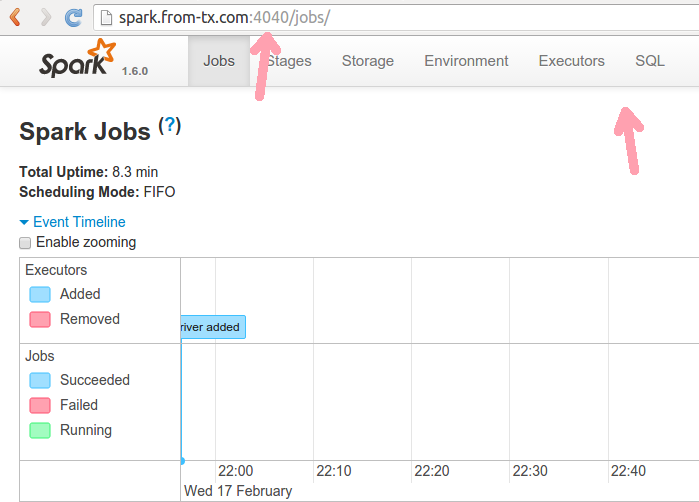
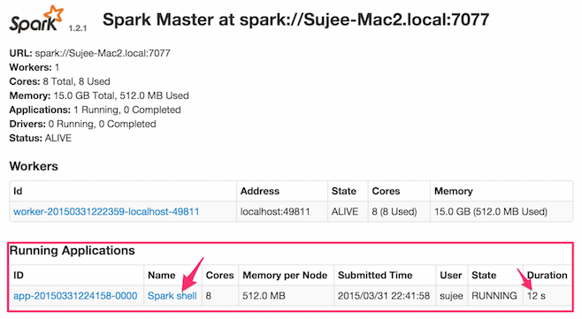
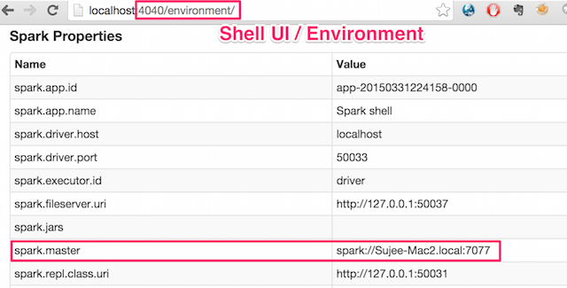

Lab 2 : Spark Shell
===================

### Objective
Get familiar with Spark shell

### Builds on
None

### Run time
approx. 20-30 minutes

### Notes
Java / Scala users follow **Scala** section

Python users follow **Python** section


----------------------------
STEP 1:  Launch  Spark shell
----------------------------

#### == Scala:
```bash
  $   cd ~/spark
  $   ./bin/spark-shell
```

Console output will look like
```
Welcome to
      ____              __
     / __/__  ___ _____/ /__
    _\ \/ _ \/ _ `/ __/  '_/
   /___/ .__/\_,_/_/ /_/\_\   version 1.2.1
      /_/
Using Scala version 2.10.4 (Java HotSpot(TM) 64-Bit Server VM, Java 1.7.0_67)
...
15/03/29 14:27:08 INFO SparkUI: Started SparkUI at http://localhost:4040
Spark context available as sc.
...
scala>
```

#### == Python:
```bash
  $   cd ~/spark
  $    ./bin/pyspark
```
Console output will look like
```
15/03/29 14:51:49 INFO SparkUI: Started SparkUI at http://localhost:4040
...
Welcome to
      ____              __
     / __/__  ___ _____/ /__
    _\ \/ _ \/ _ `/ __/  '_/
   /__ / .__/\_,_/_/ /_/\_\   version 1.2.1
      /_/

Using Python version 2.7.6 (default, Sep  9 2014 15:04:36)
SparkContext available as sc.
>>>
```
--------------------------------
STEP 2: Exploring Spark shell UI
--------------------------------
Spark shell UI is available on port 4040.

In browser go to :   http://your_machine_address:4040
(use 'public' ip of machine)

Here is a sample screen shot:
 

Explore stage, storage, environment and executor tabs

---------------------
STEP 3: Spark context
---------------------
Within Spark  shell,  variable 'sc' is the SparkContext
Type 'sc' in scala prompt and see what happens.
Your output might look like this

#### == Scala
```
scala> sc
res0: org.apache.spark.SparkContext = org.apache.spark.SparkContext@5019fb90
```

#### == Python
```
>>> sc
<pyspark.context.SparkContext object at 0x10bbec190>
```

To see all methods in sc variable, type `sc.`  and `double-TAB`
This will show all the available methods on `sc` variable.
(This only works on Scala shell for now)

Try the following:

** Q : Print the name of application name **  
`sc.appName`

** Q : Find the 'Spark master' for the shell**   
`sc.master`

Quit Spark-shell using `exit`  or pressing  `Control+D`


STEP 4: Load a file
-------------------
We have data files under `spark-labs/data`
For ease of use, let's start spark-shell from `spark-labs` directory

#### == Scala:
```bash
  $    cd  ~/spark-labs
  $    ~/spark/bin/spark-shell
```

#### == Python
```bash
  $    cd  ~/spark-labs
  $    ~/spark/bin/pyspark
```

Use test file :  'data/twinkle/sample.txt' .
The file has a favorite nursery rhyme
```
twinkle twinkle little star
how I wonder what you are
up above the world so high
like a diamond in the sky
twinkle twinkle little star
```

Let's load the file:

#### == Scala
```scala
        val f = sc.textFile("data/twinkle/sample.txt")
```

#### == Python
```python
        f = sc.textFile("data/twinkle/sample.txt")
```

#### answer the following questions:
** Q : what is the 'type' of f ? **  
hint : type `f` on the console

** Q : print the first line / record from RDD **  
hint : `f.first()`

** Q : print first 3 lines of RDD **  
hint : `take()`

** Q : print all the content from the file** 
hint : `collect()``

** Q : How many lines are in the file? **  
hint : `count()`

** Q : Inspect the 'Stages' section in Shell UI (in browser)**  


** Q : Inspect the 'Execture' section in Shell UI (in browser)**  


Quit spark-shell session `Control + D`


-------------------------------------------
STEP 5:  Connecting Shell and  Spark server
-------------------------------------------

### 5.1 Start Spark Server
If Spark server is not running, start it as
```
  $   ~/spark/sbin/start-all.sh
```

Use `jps` command to inspect the java process.  Your output might look like this.
```
731 Master
902 Jps
831 Worker
```

Spark master UI is available on port 8080.
In browser go to :   http://your_machine_address:8080
(use 'public' ip of machine)

Here is a sample screen shot:


### 5.2 Now start spark shell

#### == Scala:
```
  $    ~/spark/bin/spark-shell
```

#### == Python
```
  $    ~/spark/bin/pyspark
```

Once the shell starts, check the _server_ UI on port 8080.

** Q : Do you see the shell connected as an application?  why (not) ? **

### Step 5.3 Connect Spark shell with the Spark server.
Make a note of Spark server uri (e.g  `spark://host_name:7077`)

Quit spark shell by hitting `Control+D`

Restart spark shell as follows

#### == Scala
```
$   ~/spark/bin/spark-shell   --master  spark-server-uri
                                        ^^^^^^^^^^^^^^^^
                                    update this to match your spark server

$   ~/spark/bin/spark-shell   --master  spark://localhost:7077
```


#### == Python
```
$   ~/spark/bin/pyspark   --master  spark-server-uri
                                    ^^^^^^^^^^^^^^^^
                                    update this to match your spark server

$   ~/spark/bin/pyspark   --master  spark://localhost:7077
```

** Once the shell started, check both UIs  **

#### spark server UI at port 8080

---
#### spark shell UI at  port 4040



----------------------------------------
STEP 6: Redo step (4) in the new shell 
----------------------------------------
Now our shell is connected to a server  
Load file and test it as in Step (4)

