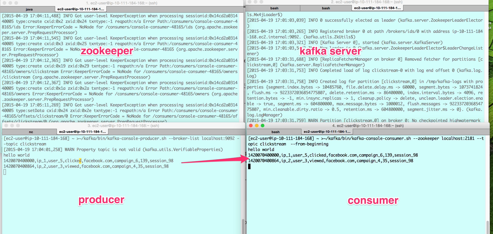

Lab : Kafka Setup
=================

### Overview
Setting up Kafka

### Depends On 
None

### Run time
20-30 mins


-----------------------------
STEP 1: Install Kafka & Setup
-----------------------------
For this it is recommended that you have 3-4 terminal sessions open

**1.1) Untar Kafka**
```bash
$    cd  #  cd to home dir
$    tar   xvf   files/kafka_2.10-0.8.2.1.tgz
$    mv   kafka_2.10-0.8.2.1    kafka  # simpler location
```
Now Kafka is in   ~/kafka directory


**1.2)  Start zookeeper (in terminal 1)**
```bash
$    ~/kafka/bin/zookeeper-server-start.sh   ~/kafka/config/zookeeper.properties
```

You will see output like
```
...
[2015-04-19 16:31:19,350] INFO binding to port 0.0.0.0/0.0.0.0:2181 (org.apache.zookeeper.server.NIOServerCnxnFactory)
```
Leave this terminal-1 alone


**1.3) Start Kafka Server (terminal-2)**
On another terminal....
```bash
$   ~/kafka/bin/kafka-server-start.sh   ~/kafka/config/server.properties
```

You should see console output like this
```
...
[2015-04-19 16:35:37,548] INFO [Kafka Server 0], started (kafka.server.KafkaServer)
[2015-04-19 16:35:37,649] INFO New leader is 0 (kafka.server.ZookeeperLeaderElector$LeaderChangeListener)
```

Very good, Kafka server is running.  
Leave terminal-2 alone


**1.4) Create Kafka topics(terminal-3)**  
Open another terminal and let's create a topic.
```bash
$  ~/kafka/bin/kafka-topics.sh --create --zookeeper localhost:2181 --replication-factor 1 --partitions 1 --topic clickstream
```
Read through the parameters.. most are self explanatory

You should see output like this...
```
Created topic "clickstream".
```

**1.5) Verify topic created**
```bash
$   ~/kafka/bin/kafka-topics.sh --list --zookeeper localhost:2181

# should see 'clickstream' in output
```

**1.6) Describe topic**
```bash
$   ~/kafka/bin/kafka-topics.sh --describe --zookeeper localhost:2181 --topic clickstream
```

You may see output like...
```
Topic:clickstream    PartitionCount:1    ReplicationFactor:1 Configs:
    Topic: clickstream  Partition: 0    Leader: 0   Replicas: 0 Isr: 0
```


---------------------
STEP 2: Testing Kafka
----------------------
Now that Kafka is running and configured, let's send some test messages through.

**Start a Kafka console producer (terminal-3)**
```bash
$    ~/kafka/bin/kafka-console-producer.sh --broker-list localhost:9092 --topic clickstream
```

Now what ever we type in this terminal will be stored in Kafka.

**Start a Kafka console consumer (terminal-4)**   
Open another terminal and start the consumer application
```bash
$   ~/kafka/bin/kafka-console-consumer.sh --zookeeper localhost:2181 --topic clickstream  --from-beginning
```


You should have a setup like this screen shot.  (Right Click on Image and choose 'Open Image in New Tab' to see the full size)



**Feed some data into Kafka producer terminal,  and see it will show up in consumer terminal**  
Try pasting the following
```
hello world
1420070400000,ip_1,user_5,clicked,facebook.com,campaign_6,139,session_98
1420070400864,ip_2,user_3,viewed,facebook.com,campaign_4,35,session_98
```


